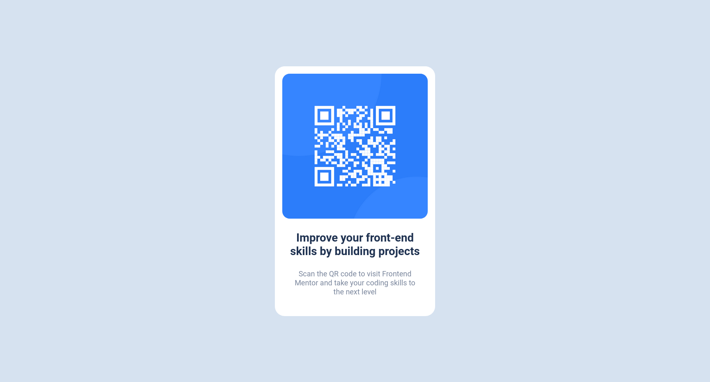

# Frontend Mentor - QR code component solution

This is a solution to the [QR code component challenge on Frontend Mentor](https://www.frontendmentor.io/challenges/qr-code-component-iux_sIO_H). Frontend Mentor challenges help you improve your coding skills by building realistic projects. 

## Table of contents

- [Overview](#overview)
  - [Screenshot](#screenshot)
  - [Links](#links)
- [My process](#my-process)
  - [Built with](#built-with)
  - [What I learned](#what-i-learned)
  - [Continued development](#continued-development)
  - [Useful resources](#useful-resources)
- [Author](#author)
- [Acknowledgments](#acknowledgments)

## Overview
I have used HTML and CSS only to completed this challenge of QR Code Component on Frontend Mentor.

### Screenshot

### Links

- Solution URL: [Add solution URL here](https://github.com/kumarmash/qr-code-component)
- Live Site URL: [Add live site URL here](https://kumarmash.github.io/qr-code-component/)

## My process

### Built with

- HTML markup
- CSS properties
- Flexbox
- Desktop-first workflow then mobile-workflow

### What I learned

After completing this challenge, I feel more confident working with HTML and CSS. I've explored different option to make the page look similar. Gained the feel of real world project. I've learned how to analyze the requirement and planning the solution.
Learned how to write README.md file as well.

### Continued development

I still feel that I need to spend some more time on Flexbox and its properties. Need to learn how to design page for specific width and screens. 

### Useful resources

## Author

- Website - [Manish Kumar] (profile site coming soon)
- Frontend Mentor - [@kumarmash](https://www.frontendmentor.io/profile/kumarmash)

## Acknowledgments
I am grateful to Frontend Mentor team  for posting such challenge on their websites. This will surely help me in becoming a good web developer.
